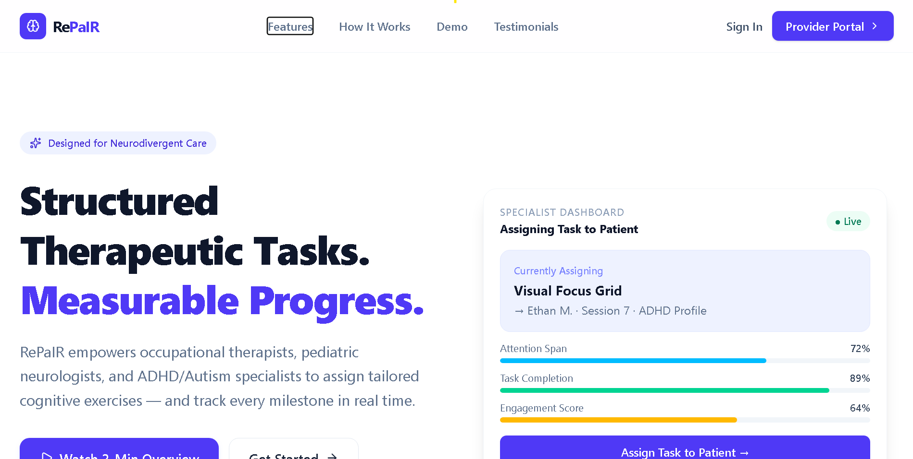

<div align="center">

<!-- Replace with your actual logo -->


<h1>RePair — Specialist Web UI</h1>

<p><em>An inclusive companion application engineered to bridge learning gaps for children. Built on the principle that technology must adapt to diverse minds, RePair delivers highly personalized guidance to individuals while providing actionable clarity and data to specialists.</em></p>

<br/>

<!-- Badges -->


<br/>

**[🚀 Live Demo](https://your-live-demo-link.com)** · **[📖 Documentation](https://your-docs-link.com)** · **[🐛 Report a Bug](https://github.com/RePaIR-ORG/Specialist-Web-UI/issues)** · **[✨ Request a Feature](https://github.com/RePaIR-ORG/Specialist-Web-UI/issues)**

<br/>

<!-- Replace with an actual screenshot -->


</div>

---

## 📑 Table of Contents

- [About the Project](#-about-the-project)
- [Tech Stack](#-tech-stack)
- [Features](#-features)
- [Getting Started](#-getting-started)
  - [Prerequisites](#prerequisites)
  - [Installation](#installation)
  - [Environment Variables](#environment-variables)
  - [Running the Dev Server](#running-the-dev-server)
- [Project Structure](#-project-structure)
- [Styling & Component Guidelines](#-styling--component-guidelines)
- [Available Scripts](#-available-scripts)
- [Contributing](#-contributing)
- [License](#-license)

---

## 🧩 About the Project

RePair is a **medical-centric, inclusive learning platform** purpose-built for specialists (therapists, educators, and clinicians) who work with children facing learning differences. The Specialist Web UI is the dedicated portal through which professionals can:

- **Monitor** child progress through a real-time, data-rich dashboard.
- **Manage** student profiles, task assignments, and session histories.
- **Personalize** interventions with clinical precision, backed by live analytics.

> **Our core belief:** Technology must adapt to diverse minds — not the other way around.

---

## 🛠️ Tech Stack

| Category | Technology | Version |
|---|---|---|
| **Framework** | [React](https://react.dev/) | `^19` |
| **Styling** | [Tailwind CSS](https://tailwindcss.com/) | `^4.x` |
| **Build Tool** | [Vite](https://vitejs.dev/) | `^8.x` |
| **Routing** | [React Router DOM](https://reactrouter.com/) | `^7.x` |
| **State Management** | [Zustand](https://zustand-demo.pmnd.rs/) | `^5.x` |
| **UI Components** | [Radix UI](https://www.radix-ui.com/) | `^1/^2` |
| **Charts & Analytics** | [Recharts](https://recharts.org/) + [Tremor](https://www.tremor.so/) | `^2 / ^3` |
| **Icons** | [Lucide React](https://lucide.dev/) + [Heroicons](https://heroicons.com/) | Latest |
| **Utilities** | [clsx](https://github.com/lukeed/clsx) + [tailwind-merge](https://github.com/dcastil/tailwind-merge) + [CVA](https://cva.style/) | Latest |
| **Date Handling** | [date-fns](https://date-fns.org/) + [React Day Picker](https://react-day-picker.js.org/) | Latest |
| **Animations** | [AutoAnimate](https://auto-animate.formkit.com/) | `^0.9` |
| **Linting** | [ESLint](https://eslint.org/) w/ React Hooks plugin | `^9.x` |

---

## ✨ Features

- 🔐 **User Authentication** — Secure sign-in / sign-up flow with protected routes, keeping patient data safe and access controlled.
- 🌗 **Dark Mode** — Fully implemented system-aware and toggle-able dark/light theme, easy on the eyes during long clinical sessions.
- 📊 **Real-time Dashboard** — A live, data-rich overview of student progress, task completion rates, and specialist activity — powered by Recharts and Tremor.
- 🏥 **Medical-Centric Design** — UI and data models tailored for specialist workflows: student profiles, clinical notes, and task management in one place.
- 👤 **Student Management** — Create, view, and manage detailed student profiles with task history and progress tracking.
- 📋 **Task Assignment System** — Assign personalized tasks to students and monitor completion from a centralized view.
- 📱 **Responsive Layout** — A professional sidebar-driven layout that works seamlessly across desktop and tablet screen sizes.
- ♿ **Accessible by Design** — Built on Radix UI primitives, ensuring WAI-ARIA compliant components out of the box.

---

## 🚀 Getting Started

Follow these steps to get a local instance of the Specialist Web UI running on your machine.

### Prerequisites

Make sure you have the following installed:

- **Node.js** `>= 20.x` — [Download here](https://nodejs.org/en/download)
- **npm** `>= 10.x` (bundled with Node.js)

Verify your installations:
```bash
node -v
npm -v
```

### Installation

**1. Clone the repository:**
```bash
git clone https://github.com/RePaIR-ORG/Specialist-Web-UI.git
cd Specialist-Web-UI
```

**2. Install dependencies:**
```bash
npm install
```

### Environment Variables

This project requires environment variables to connect to its backend services. Create a `.env` file in the project root by copying the example:

```bash
cp .env.example .env
```

Then fill in the required values in your `.env` file:

```env
# Backend API base URL
VITE_API_BASE_URL=http://localhost:5000/api

# Authentication provider (if applicable)
VITE_AUTH_SECRET=your_secret_key_here
```

> **⚠️ Important:** Never commit your `.env` file to version control. It is already included in `.gitignore`.

### Running the Dev Server

Start the Vite development server:

```bash
npm run dev
```

The application will be available at **[http://localhost:5173](http://localhost:5173)** by default.

---

## 📁 Project Structure

```
Specialist-Web-UI/
├── public/                   # Static assets (favicon, logo, images)
│
├── src/
│   ├── assets/               # Images, fonts, and other bundled assets
│   │
│   ├── components/           # Reusable UI components
│   │   ├── layout/
│   │   │   ├── DashboardLayout.jsx   # Main app shell (sidebar + content area)
│   │   │   └── Sidebar.jsx           # Navigation sidebar
│   │   ├── ui/               # shadcn/ui-style primitive components
│   │   │   ├── avatar.jsx
│   │   │   ├── badge.jsx
│   │   │   ├── button.jsx
│   │   │   ├── card.jsx
│   │   │   ├── chart.jsx
│   │   │   ├── dialog.jsx
│   │   │   ├── dropdown-menu.jsx
│   │   │   ├── input.jsx
│   │   │   ├── label.jsx
│   │   │   ├── select.jsx
│   │   │   └── separator.jsx
│   │   ├── ThemeToggle.jsx   # Dark/light mode toggle button
│   │
│   ├── store/                # Zustand state management
│   │   ├── index.js          # Barrel exports for stores
│   │   ├── useAuthStore.js   # Authentication and session state
│   │   ├── useThemeStore.js  # Dark/light theme persistence
│   │   ├── useUIStore.js     # Ephemeral UI states (sidebar toggles)
│   │   └── useUserStore.js   # User profile and integrity metadata
│   │
│   ├── data/                 # Static data, mock data, and constants
│   │
│   ├── lib/
│   │   └── utils.js          # Utility helpers (cn(), etc.)
│   │
│   ├── pages/                # Route-level page components
│   │   ├── LandingPage.jsx
│   │   ├── SignInPage.jsx
│   │   ├── SignUpPage.jsx
│   │   ├── DashboardPage.jsx
│   │   ├── StudentsPage.jsx
│   │   ├── StudentDetailsPage.jsx
│   │   ├── CreateStudentPage.jsx
│   │   ├── StudentTasksPage.jsx
│   │   ├── TasksPage.jsx
│   │   └── ProfilePage.jsx
│   │
│   ├── services/             # API calls and external service integrations
│   │
│   ├── App.jsx               # Root component with router configuration
│   ├── App.css               # Global component-level styles
│   ├── main.jsx              # Application entry point
│   └── index.css             # Global CSS & Tailwind directives
│
├── .env                      # Local environment variables (DO NOT COMMIT)
├── .env.example              # Environment variable template
├── .gitignore
├── components.json           # shadcn/ui component configuration
├── eslint.config.js          # ESLint flat config
├── jsconfig.json             # JS path aliases
├── index.html                # HTML entry point
├── vite.config.js            # Vite build configuration
└── package.json
```

---

## 🎨 Styling & Component Guidelines

This project uses **Tailwind CSS v4** with a component-driven architecture. Please follow these conventions when contributing new UI.

### ✅ Keep Classes Organized

For elements with many classes, group them logically and use the `cn()` utility to keep JSX clean and readable.

```jsx
// ✅ Good — logical grouping + cn() utility
import { cn } from "@/lib/utils";

function Card({ className, isActive }) {
  return (
    <div
      className={cn(
        // Layout
        "flex flex-col gap-4 p-6",
        // Visual
        "rounded-xl border bg-card shadow-sm",
        // State
        isActive && "border-primary ring-2 ring-primary/20",
        // External overrides
        className
      )}
    />
  );
}
```

```jsx
// ❌ Avoid — a single unreadable string of classes
<div className="flex flex-col gap-4 p-6 rounded-xl border bg-card shadow-sm border-primary ring-2 ring-primary/20" />
```

### ✅ Use `clsx` + `tailwind-merge` via `cn()`

The `cn()` helper in `src/lib/utils.js` combines `clsx` and `tailwind-merge` to safely compose dynamic class names without conflicts.

```js
// src/lib/utils.js
import { clsx } from "clsx";
import { twMerge } from "tailwind-merge";

export function cn(...inputs) {
  return twMerge(clsx(inputs));
}
```

> **Why `tailwind-merge`?** It intelligently resolves Tailwind class conflicts (e.g., `p-4` + `p-6` → `p-6`), preventing specificity bugs that `clsx` alone cannot handle.

### ✅ Use `class-variance-authority` (CVA) for Variants

For components with multiple visual variants (like `Button`), use CVA to define a clean, type-safe variant API.

```jsx
import { cva } from "class-variance-authority";

const buttonVariants = cva(
  // Base classes applied to every variant
  "inline-flex items-center justify-center rounded-md font-medium transition-colors",
  {
    variants: {
      variant: {
        default: "bg-primary text-primary-foreground hover:bg-primary/90",
        outline: "border border-input bg-transparent hover:bg-accent",
        ghost: "hover:bg-accent hover:text-accent-foreground",
      },
      size: {
        sm:  "h-8 px-3 text-xs",
        md:  "h-10 px-4 text-sm",
        lg:  "h-12 px-6 text-base",
      },
    },
    defaultVariants: {
      variant: "default",
      size: "md",
    },
  }
);
```

### ✅ Custom Theme Configuration

Project-specific design tokens (colors, fonts, spacing) are configured in `index.css` using Tailwind v4's CSS-first config. Add custom tokens here rather than using arbitrary values in class names.

```css
/* src/index.css */
@import "tailwindcss";

@theme {
  --color-primary: oklch(62% 0.2 240);
  --color-primary-foreground: oklch(98% 0 0);
  --color-card: oklch(100% 0 0);
  --font-sans: "Inter", sans-serif;
  /* ... other tokens */
}
```

---

## 📦 Available Scripts

All scripts are run from the project root using `npm run <script>`.

| Script | Command | Description |
|---|---|---|
| **`dev`** | `npm run dev` | Starts the Vite HMR development server at `localhost:5173`. |
| **`build`** | `npm run build` | Compiles and bundles the app for production into the `dist/` folder. |
| **`preview`** | `npm run preview` | Locally serves the production `dist/` build for final verification. |
| **`lint`** | `npm run lint` | Runs ESLint across the entire codebase to catch errors and style issues. |

---

## 🤝 Contributing

Contributions are what make the open-source community such an amazing place to learn, inspire, and create. **Any contributions you make are greatly appreciated.**

1. **Fork** the repository.
2. **Create** your feature branch: 
```
git checkout -b feature/AmazingFeature
```
3. **Commit** your changes: 
```
git commit -m 'feat: Add some AmazingFeature'
```
4. **Push** to the branch: 
```
git push origin feature/AmazingFeature
```
5. **Open a Pull Request** against the `main` branch.

Please make sure to:
- Follow the [Styling & Component Guidelines](#-styling--component-guidelines) above.
- Run `npm run lint` before submitting and resolve any errors.
- Write clear, descriptive commit messages (we recommend [Conventional Commits](https://www.conventionalcommits.org/)).

> We follow the **[Contributor Covenant](https://www.contributor-covenant.org/)** Code of Conduct. Please be respectful and inclusive in all interactions.

---

## 📄 License

Distributed under the **MIT License**. See [`LICENSE`](./LICENSE) for more information.

---

<div align="center">

Made with ❤️ by the **RePaIR Team** — *Bridging learning gaps, one child at a time.*

</div>
